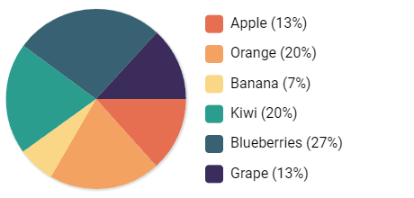

# Graph Maven

This is a personal project undertaken to explore graphs and animation. It produces pie graphs like the one below.



## Run Locally

Clone the project

```bash
  git clone https://github.com/jenniferanneaus/graph-maven.git
```

Go to the project directory

```bash
  cd graph-maven
```

Install dependencies

```bash
  yarn install
```

Start the server

```bash
  yarn dev
```
